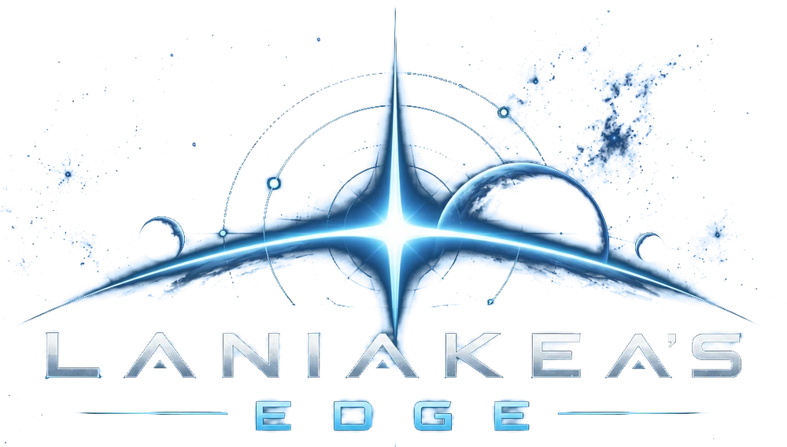

<p align="center"></p>

<p align="center"><b>Turn-based fleet combat in the browser.</b><br>
Close the distance, strip their shields and break their line before they break yours.</p>

<p align="center"><a href="https://jdartigas.github.io/hard-burn/"><b>▶ Play it now</b></a></p>

---

Laniakea's Edge is a 2.5D tactical space battle game. You command a fleet against an AI fleet on a hex grid strewn
with destructible asteroids, in hard-science settings from Earth orbit to the asteroid belt. Ships are modeled in
code after a set of painted, 3D-printed miniatures, in a style inspired by *The Expanse*.

It runs entirely in the browser: no install, no account, nothing to download.

## Features

- **Ten ship classes**, from the 75 m Patrol craft to the 390 m Dreadnought, each with its own weapons, ability and job:
  escorts that screen missiles, tenders that repair and rearm, electronic-warfare ships that blind the enemy.
- **Four weapon families** that play differently: beams, pulse cannons, railguns with no range limit (a nimble target
  dodges a long shot) and guided missiles, torpedoes and strike wings that point defense can shoot down.
- **A real damage model.** Shields, armor and hull, plus criticals that knock out weapons, engines, shields, point
  defense, sensors or a magazine. Dying ships explode and hurt everything next to them, friend or foe.
- **Readable at a glance.** Hit chance and expected damage before you fire, a threat overlay showing where enemy
  fire can reach, system status on every ship, and a reason whenever an order can't be carried out.
- **Fleets your way.** Quick battle (four ships each, about ten minutes), five preset fleets, a fleet builder with
  point budgets, or let the AI build its own fleet against you. Three difficulty levels.
- **Real places.** Fight in high Earth orbit, beside Phobos, in the asteroid belt or inside Io's orbit, under the real
  sky of naked-eye stars, or in the fictional Shattered Reach.
- **A guided first battle** that teaches the game as you play it.
- Scores, records and a battle summary with an MVP, all stored in your browser, with export and import.
- Works with mouse, keyboard and touch, on desktop, tablet and phone.

## How to play

Each turn, every one of your ships can **move**, **fire each ready weapon once** and **use its ability** when it's
charged, in any order. Then the enemy takes its turn. Destroy the enemy fleet, or hold more fleet value when the turn
limit runs out (30 turns, or 15 in a Quick battle).

New to it? Press **Tutorial** on the main menu.

| Action | Mouse | Touch | Keys |
|---|---|---|---|
| Select a ship | Click it | Tap it | Tab: next ship |
| Move | Click a blue hex | Tap a blue hex | |
| Fire | Click an enemy or asteroid | Tap an enemy or asteroid | 1–3 pick a weapon, F all weapons |
| Ability | Ability button | Ability button | Q |
| Threat overlay | Threat button | Threat button | T |
| End turn | End turn button | End turn button | Space |
| Camera | Drag to orbit, Shift-drag to pan, scroll to zoom | Drag to orbit, two fingers to pan and pinch | WASD pan, C centre, Z zoom and follow |
| Cancel | Right-click or Esc | | Esc |

M toggles music, N effects, G graphics quality, H help and P the menu.

## Running it locally

There's no build step. The game is static files: HTML, CSS and plain JavaScript, with
[Three.js](https://threejs.org/) r169 loaded from a CDN.

```bash
git clone https://github.com/jdartigas/hard-burn.git
cd hard-burn
python3 -m http.server 8000
```

Then open <http://localhost:8000/>. Serve the folder rather than opening `index.html` directly: the planet textures
load by relative path, which browsers block for pages opened from disk.

It needs a browser with WebGL. If the screen looks too dark, there's a Brightness slider in Settings; if it runs
slowly, press G to step the graphics quality down.

## Under the hood

- **Three.js / WebGL** with a post-processing chain (ambient occlusion, bloom, SMAA) and three quality presets.
- **Everything is generated in code:** ship models, asteroids, nebulae, the music and most sound effects. The only
  files on disk are real data: NASA planetary maps, a star catalogue and a handful of CC0 sound effects.
- **Deterministic battles.** Every outcome comes from a seeded random generator, so a battle replays exactly from its
  seed and your orders. A built-in simulator plays thousands of AI-against-AI battles to balance the fleets.

Developer notes live in [`CLAUDE.md`](CLAUDE.md), and planned work in [`BACKLOG.md`](BACKLOG.md).

## Credits

Planet maps from NASA, USGS and JPL (public domain); stars from the HYG Database by David Nash (CC BY-SA 4.0); sound
effects from Kenney's Sci-Fi Sounds and Impact Sounds packs (CC0). Full sources and licenses are in
[`assets/CREDITS.md`](assets/CREDITS.md).

Laniakea's Edge was called Hard Burn early in development, which is why the repository still carries that name.
